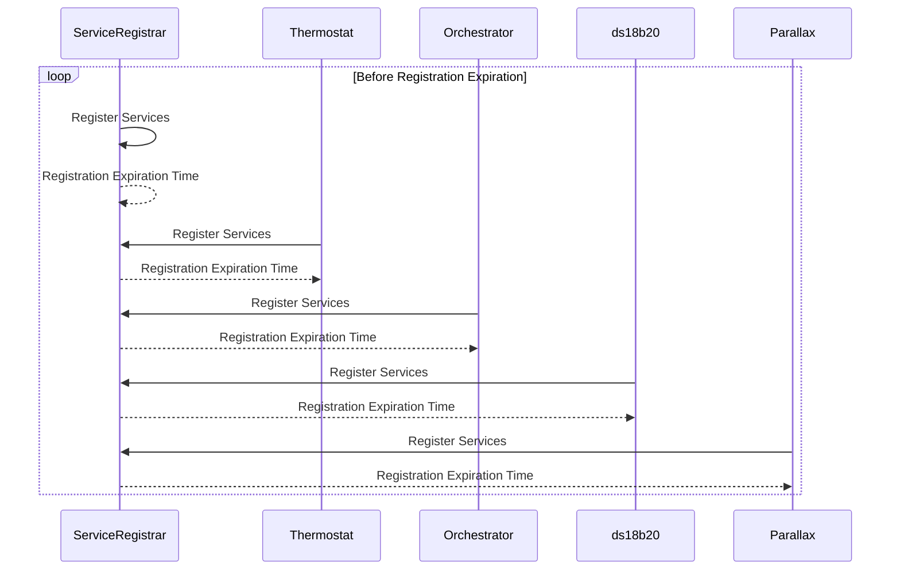
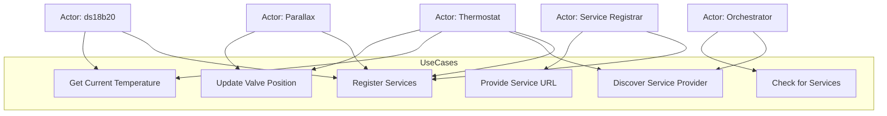
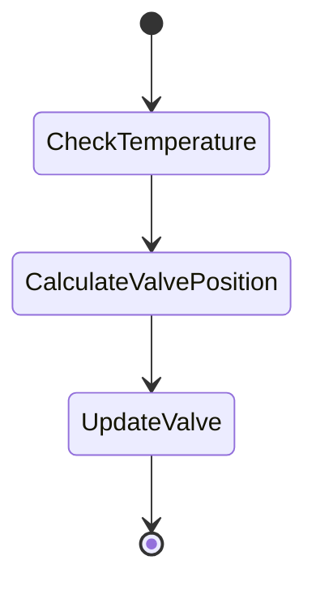
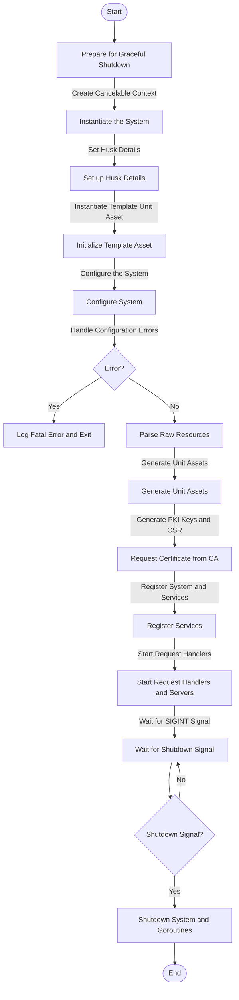

# My Project

Welcome to **My Project**! This repository demonstrates how to use Mermaid diagrams in a GitHub `README.md` file.

## Features
- Service registration process
- Service provider discovery
- Periodic temperature updates

---

## Sequence Diagram: Service Registration

This diagram shows how services register themselves with the `ServiceRegistrar`.

